# Sprawozdanie z wdrożenia aplikacji Ankiety Live w Kubernetes

## 1. Informacje o projekcie
Aplikacja Ankiety Live służy do tworzenia ankiet, oddawania głosów i obserwowania wyników w czasie rzeczywistym. System zawiera manifesty dla przestrzeni nazw, workloadów, usług, Ingress z TLS, storage, konfiguracji, sekretów, limitów zasobów, polityk sieciowych i mechanizmów planowania Podów.

**Struktura katalogów projektu:**

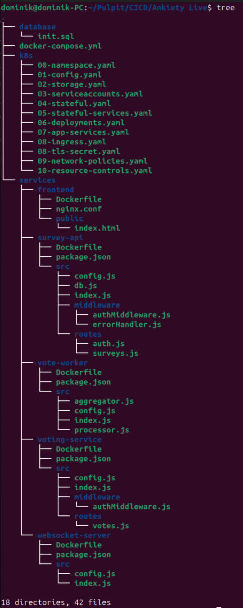

## 2. Architektura aplikacji

System składa się z siedmiu podstawowych komponentów:

| Komponent | Plik opisujący obraz | Obraz bazowy | Główna rola kontenera |
| --- | --- | --- | --- |
| `frontend` | `services/frontend/Dockerfile` | `nginx:1.27-alpine` | Serwowanie statycznego frontendu i reverse proxy do API/WebSocket. |
| `survey-api` | `services/survey-api/Dockerfile` | `node:20-alpine` | API ankiet, użytkowników i autoryzacji. |
| `voting-service` | `services/voting-service/Dockerfile` | `node:20-alpine` | Przyjmowanie głosów i zapis do Redis. |
| `vote-worker` | `services/vote-worker/Dockerfile` | `node:20-alpine` | Przetwarzanie bufora głosów i zapis agregatów do PostgreSQL. |
| `websocket-server` | `services/websocket-server/Dockerfile` | `node:20-alpine` | Obsługa komunikacji WebSocket i publikacja wyników w czasie rzeczywistym. |
| `postgres` | obraz publiczny | `postgres:16-alpine` | Relacyjna baza danych systemu. |
| `redis` | obraz publiczny | `redis:7-alpine` | Bufor głosów, cache i pub/sub. |

Podział na mikroserwisy został zachowany zgodnie z istniejącą aplikacją. Warstwa aplikacyjna jest bezstanowa, a stan systemu jest przeniesiony do PostgreSQL i Redis. Dzięki temu możliwe jest skalowanie wybranych mikroserwisów bez przenoszenia danych lokalnie między Pod-ami.

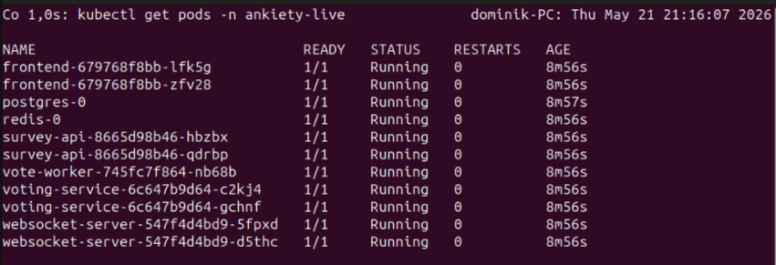


Obrazy usług Node.js mają wspólną strukturę:

- `FROM node:20-alpine` - lekki obraz bazowy z Node.js 20.
- `WORKDIR /app` - katalog roboczy aplikacji.
- `COPY --chown=node:node package.json ...` - skopiowanie opisu zależności z właścicielem ustawionym na użytkownika `node`.
- `RUN npm install --omit=dev` - instalacja tylko zależności produkcyjnych.
- `COPY --chown=node:node src/ ./src/` - skopiowanie kodu źródłowego aplikacji.
- `USER node` - uruchamianie procesu jako użytkownik nieuprzywilejowany.
- `CMD ["node", "src/index.js"]` - komenda startowa mikrousługi.

Dodatkowo `survey-api` i `voting-service` mają `HEALTHCHECK`, ponieważ udostępniają endpoint `/health`. `websocket-server` ma healthcheck realizowany przez Kubernetes readiness/liveness probe na `/health`. `vote-worker` nie wystawia portu HTTP, ponieważ jest procesem w tle przetwarzającym kolejkę.

Obraz `frontend` bazuje na NGINX. Dockerfile usuwa domyślną konfigurację, kopiuje własny plik `nginx.conf`, kopiuje statyczne pliki z `public/`, wystawia port `8080` i definiuje healthcheck na `/health`. Konfiguracja NGINX przekazuje ruch `/api/auth`, `/api/surveys`, `/api/votes` i `/ws` do odpowiednich usług K8s.

## 3. Wybór klastra Minikube

Do uruchomienia projektu wybrano Minikube, ponieważ Minikube pozwala w łatwy sposób korzystać z dodatków takich jak Ingress oraz metrics-server. Istotną uwagą jest, że w przygotowanym środowisku Minikube działa wewnątrz maszyny wirtualnej. Początkowo aplikacja testowana jest na jednowęzłowym Kubernetes, docelowo dodany do niego zostanie kolejny węzeł. Pozwoli to zaobserwować możliwości skalowania aplikacji przy skalowaniu infrastruktury.

Klaster został uruchomiony z driverem Docker:

```bash
minikube start --driver=docker --cpus=4 --memory=6144 --disk-size=30g --cni=calico --addons=ingress,metrics-server
```

Wybrane parametry:

- `--driver=docker` - dobry wybór dla Ubuntu uruchomionego w maszynie wirtualnej; Minikube tworzy klaster jako kontener Dockera, bez potrzeby tworzenia kolejnej maszyny wirtualnej wewnątrz VM.
- `--cpus=4` - wystarczające dla kilku mikroserwisów Node.js, PostgreSQL, Redis i kontrolera Ingress.
- `--memory=6144` - ilość pamięci wystarczająca do uruchomienia PostgreSQL, Redis, kilku usług Node.js, Ingress i Calico, przy zachowaniu zapasu dla systemu VM.
- `--disk-size=30g` - zapewnia miejsce na obrazy kontenerów, wolumeny i dane PostgreSQL/Redis.

Zastosowano również `--cni=calico`, egzekwowanie `NetworkPolicy` wymaga CNI obsługującego ten mechanizm. Bez Calico manifesty `NetworkPolicy` mogłyby zostać utworzone, ale nie byłyby realnie wymuszane przez warstwę sieciową.

Ingress jest potrzebny do udostępnienia aplikacji przez nazwę domenową `ankiety-live.local`. Metrics-server jest przydatny do obserwowania zużycia zasobów przez `kubectl top`.

**Działający klaster:**

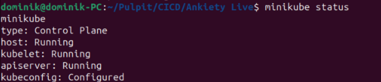

**Na poniższym zrzucie ekranu widoczne są pody odpowiedzialne za działanie pluginów calico i ingress.**

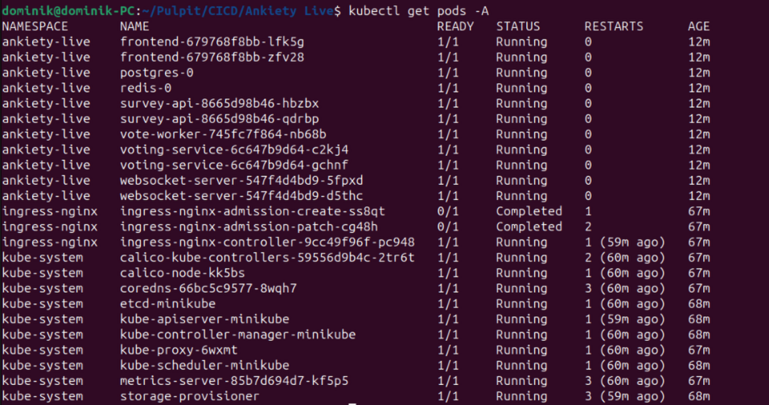


## 4. Przygotowanie obrazów kontenerowych

Obrazy aplikacji muszą być dostępne w runtime kontenerów używanym przez Minikube. Samo `docker build` wykonane w zwykłym Dockerze hosta lub maszyny wirtualnej może nie wystarczyć, ponieważ Minikube może korzystać z osobnego środowiska obrazów. Objawem tego problemu jest stan Pod-ów `ErrImagePull` albo `ImagePullBackOff` dla obrazów `ankiety-live/*`.

Należy na hoście zbudować obrazy:

```bash
docker build -t ankiety-live/survey-api:1.0.0 services/survey-api
docker build -t ankiety-live/voting-service:1.0.0 services/voting-service
docker build -t ankiety-live/vote-worker:1.0.0 services/vote-worker
docker build -t ankiety-live/websocket-server:1.0.0 services/websocket-server
docker build -t ankiety-live/frontend:1.0.0 services/frontend
```

Następnie można załadować obrazy do Minikube:

```bash
minikube image load ankiety-live/survey-api:1.0.0
minikube image load ankiety-live/voting-service:1.0.0
minikube image load ankiety-live/vote-worker:1.0.0
minikube image load ankiety-live/websocket-server:1.0.0
minikube image load ankiety-live/frontend:1.0.0
```

Po zbudowaniu lub załadowaniu obrazów warto sprawdzić ich dostępność:

```bash
minikube image ls | grep ankiety-live
```

Takie podejście jest wystarczające dla tego konkretnego zastosowania, ponieważ nie wymaga publikowania obrazów w zewnętrznym registry. W środowisku produkcyjnym należy jednak skorzystać z rejestru obrazów.

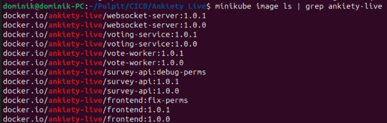

## 5. Namespace

W pliku `k8s/00-namespace.yaml` utworzono dedykowaną przestrzeń nazw:

```yaml
kind: Namespace
metadata:
  name: ankiety-live
```

Namespace separuje zasoby aplikacji od zasobów systemowych i innych projektów. Ułatwia również zarządzanie politykami sieciowymi, limitami zasobów, listowaniem obiektów i ewentualnym usunięciem całego wdrożenia.

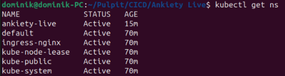

## 6. ConfigMap i Secret

W `k8s/01-config.yaml` utworzono:

- `ConfigMap` `ankiety-config` - porty, hosty usług, nazwa bazy, użytkownik bazy, ustawienia workera.
- `Secret` `ankiety-secrets` - hasło PostgreSQL i sekret JWT.
- `ConfigMap` `postgres-init` - skrypt inicjalizacyjny PostgreSQL.

W `k8s/08-tls-secret.yaml` utworzono dodatkowo `Secret` typu `kubernetes.io/tls` o nazwie `ankiety-live-tls`. Zawiera on certyfikat self-signed dla hosta `ankiety-live.local` oraz klucz prywatny używany przez Ingress.

Jest to standardowy sposób konfiguracji aplikacji w Kubernetes. Pozwala oddzielić konfigurację od obrazu kontenera. Dane wrażliwe nie są wpisane bezpośrednio w Deploymentach, tylko znajdują się w obiekcie `Secret`. Certyfikat self-signed został zapisany deklaratywnie w manifestach, dzięki czemu odtworzenie środowiska nie wymaga ręcznego polecenia `kubectl create secret`.

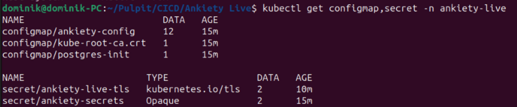

## 7. Storage, PVC i StorageClass

W pliku `k8s/02-storage.yaml` zdefiniowano:

- `StorageClass` `ankiety-hostpath`,
- PVC `postgres-data` o rozmiarze 1 Gi,
- PVC `redis-data` o rozmiarze 512 Mi.

Kontenery i Pod-y mogą być restartowane lub odtwarzane. Dane aplikacji muszą mieć cykl życia niezależny od Pod-a. StorageClass `k8s.io/minikube-hostpath` jest dobrany do Minikube, ponieważ zapewnia prosty dynamiczny provisioning lokalnych wolumenów w środowisku laboratoryjnym. `reclaimPolicy: Retain` ogranicza ryzyko przypadkowej utraty danych po usunięciu zasobów.

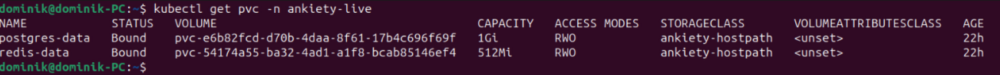

## 8. StatefulSet dla PostgreSQL i Redis

PostgreSQL i Redis zostały uruchomione jako `StatefulSet` w pliku `k8s/04-stateful.yaml`. `StatefulSet` jest przeznaczony dla aplikacji stanowych, gdzie ważna jest stabilna tożsamość Pod-a i powiązanie z wolumenem. Wdrożenie ma po jednej replice dla każdego komponentu, ponieważ aplikacja nie zawiera konfiguracji klastra PostgreSQL ani Redis Sentinel/Cluster.

Dla obu komponentów dodano sondy:

- PostgreSQL: `pg_isready`,
- Redis: `redis-cli ping`.

Sondy pozwalają Kubernetes wykrywać gotowość i stan usług.

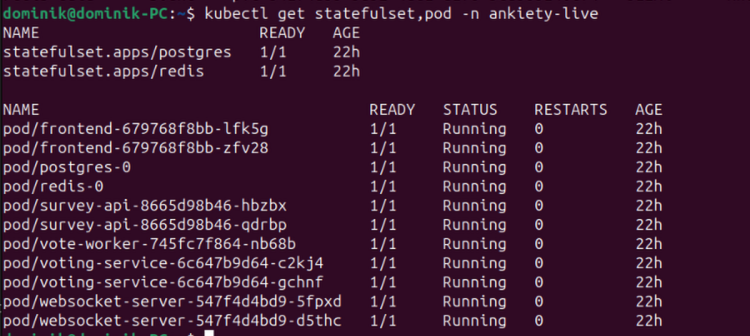

## 9. Deployment dla mikroserwisów aplikacyjnych

W pliku `k8s/06-deployments.yaml` utworzono Deploymenty:

- `frontend`,
- `survey-api`,
- `voting-service`,
- `websocket-server`,
- `vote-worker`.

Te procesy nie przechowują trwałego stanu lokalnie. Deployment zapewnia samonaprawianie, rolling update, rollback i skalowanie. 

Nie zastosowano `DaemonSet`, ponieważ aplikacja nie ma komponentu, który musiałby działać na każdym węźle klastra, takiego jak agent logowania, monitoring hosta lub plugin systemowy. Dla usług aplikacyjnych właściwym wyborem jest `Deployment`, a dla PostgreSQL i Redis `StatefulSet`.

Liczba replik:

- `frontend`: 2 - może być skalowany, bo serwuje statyczne pliki i proxy.
- `survey-api`: 2 - stan jest w PostgreSQL/Redis.
- `voting-service`: 2 - głosy są buforowane we wspólnym Redis.
- `websocket-server`: 2 - aktualizacje są rozgłaszane przez Redis pub/sub.
- `vote-worker`: 1 - jedna replika ogranicza ryzyko równoległego przetwarzania tej samej kolejki bez dodatkowego mechanizmu blokad.

Dla mikroserwisów HTTP dodano readiness/liveness probes pod `/health`.

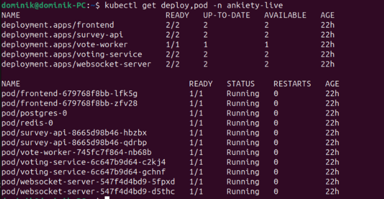

## 10. Services

W plikach `k8s/05-stateful-services.yaml` i `k8s/07-app-services.yaml` utworzono usługi:

- `frontend:8080`,
- `survey-api:3000`,
- `voting-service:3001`,
- `websocket-server:3002`,
- `postgres:5432`,
- `redis:6379`.

Wszystkie Services mają typ `ClusterIP`. Mikroserwisy komunikują się wewnątrz klastra. Nie ma potrzeby wystawiać każdej usługi na zewnątrz. `ClusterIP` daje stabilną nazwę DNS i adres wewnętrzny, a jedynym publicznym punktem wejścia jest Ingress. To ogranicza powierzchnię dostępu i upraszcza routing.


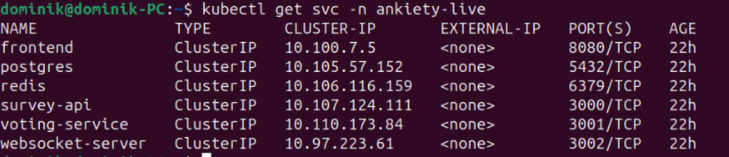

## 11. Ingress, TLS i dostęp z zewnątrz

W pliku `k8s/08-ingress.yaml` utworzono Ingress dla hosta:

```text
ankiety-live.local
```

Ingress korzysta z klasy `nginx` i kieruje ruch dla hosta `ankiety-live.local` do usługi `frontend`. Aplikacja jest webowa i korzysta z HTTP/WebSocket. Ingress jest właściwą warstwą routingu dla takiego przypadku, pozwala obsługiwać jeden host i jedno wejście do systemu.

Ruch HTTP oraz HTTPS trafia do frontendu, a NGINX we frontendzie przekazuje dalej:

- `/api/auth` do `survey-api`,
- `/api/surveys` do `survey-api`,
- `/api/votes` do `voting-service`,
- `/ws` do `websocket-server`.

W tym samym Ingressie skonfigurowano TLS:

```yaml
tls:
  - hosts:
      - ankiety-live.local
    secretName: ankiety-live-tls
```

Nawet w środowisku lokalnym warto stosować wariant HTTPS, ponieważ jest to docelowy sposób udostępniania aplikacji webowych. Certyfikat self-signed powoduje ostrzeżenie w przeglądarce, ale ruch jest terminowany przez Ingress jako HTTPS.

Po uruchomieniu Ingress należy sprawdzić IP Minikube:

```bash
minikube ip
```

Następnie należy dodać wpis do `/etc/hosts`:

```bash
echo "$(minikube ip) ankiety-live.local" | sudo tee -a /etc/hosts
```

Jest to konieczne, ponieważ lokalny host `ankiety-live.local` nie istnieje w publicznym DNS. Wpis w `/etc/hosts` pozwala przeglądarce i `curl` kierować ruch do adresu IP Minikube, gdzie działa kontroler Ingress.

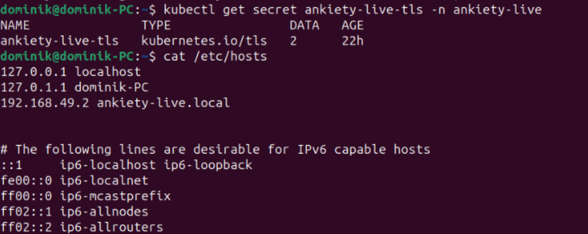

## 12. Ograniczenia zasobów

Każdy kontener ma określone `resources.requests` i `resources.limits`.

Dodatkowo w pliku `k8s/10-resource-controls.yaml` utworzono:

- `ResourceQuota` dla namespace,
- `LimitRange` z domyślnymi limitami.

Wdrożenie realizuje ograniczenie wykorzystywanych zasobów na trzech poziomach:

- per kontener przez `resources.requests` i `resources.limits`,
- per namespace przez `ResourceQuota`,
- przez wartości domyślne i maksymalne w `LimitRange`.

`requests` pomagają schedulerowi prawidłowo rozmieszczać Pod-y, a `limits` chronią klaster przed nadmiernym zużyciem CPU i RAM przez pojedynczy kontener. `ResourceQuota` ogranicza łączne zużycie zasobów w namespace, liczbę Pod-ów i liczbę PVC. `LimitRange` zapewnia wartości domyślne dla kontenerów oraz blokuje przypadkowe utworzenie kontenera o zbyt dużym limicie.

Wartości są dobrane do Minikube i aplikacji: PostgreSQL i Redis dostają więcej pamięci, mikroserwisy Node.js mniej, a frontend najmniej.

Przykładowe decyzje:

- PostgreSQL: `requests.memory: 256Mi`, `limits.memory: 512Mi`, ponieważ przechowuje dane i wykonuje operacje SQL.
- Redis: `requests.memory: 128Mi`, `limits.memory: 384Mi`, ponieważ działa jako bufor i cache.
- `survey-api`: 2 repliki z limitem `500m CPU / 384Mi RAM`, ponieważ obsługuje logowanie i operacje na ankietach.
- `frontend`: niższe wartości, ponieważ NGINX serwuje statyczne pliki i przekazuje ruch.

Dzięki temu konfiguracja jest bezpieczniejsza dla klastra Minikube, który ma ograniczone zasoby.

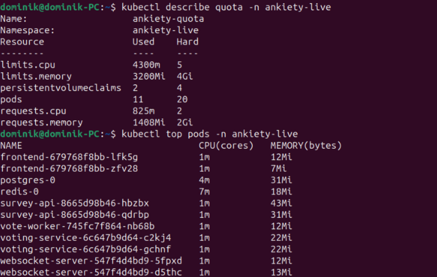

## 13. NetworkPolicy

W pliku `k8s/09-network-policies.yaml` utworzono polityki sieciowe:

- `default-deny` - domyślnie blokuje ruch przychodzący i wychodzący,
- `allow-ingress-to-frontend` - pozwala kontrolerowi Ingress łączyć się z frontendem,
- `allow-frontend-to-backend` - pozwala frontendowi łączyć się z API i WebSocket,
- `allow-backend-to-data` - pozwala mikroserwisom aplikacyjnym łączyć się z PostgreSQL i Redis,
- `allow-runtime-egress` - pozwala na DNS i wymaganą komunikację wewnętrzną.

Zastosowano model `default-deny` plus jawne reguły `allow`. Najbezpieczniejszym podejściem jest najpierw zablokowanie komunikacji, a następnie dopuszczenie tylko wymaganych przepływów. Taki model ogranicza skutki ewentualnej kompromitacji pojedynczego Pod-a.

NetworkPolicy wymaga CNI, które je obsługuje, np. Calico, które zostało wykorzystane w tym przypadku. Jeżeli klaster został uruchomiony bez Calico, same manifesty NetworkPolicy mogą zostać utworzone, ale nie będą egzekwowane przez sieć.

Logiczny model komunikacji jest następujący:

- z zewnątrz klastra ruch trafia tylko do kontrolera Ingress,
- Ingress może kierować ruch tylko do `frontend`,
- `frontend` może komunikować się z `survey-api`, `voting-service` i `websocket-server`,
- komponenty backendowe i worker mogą komunikować się z PostgreSQL i Redis,
- wszystkie Pod-y mają dozwolony egress do DNS w `kube-system`, aby mogły rozwiązywać nazwy usług K8s.

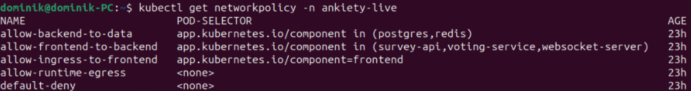

## 14. Planowanie Pod-ów

W Deploymentach dodano mechanizmy wspierające scheduler:

- `resources.requests`,
- `topologySpreadConstraints`,
- preferowane `podAntiAffinity` dla `survey-api`.

Mechanizmy planowania zostały dobrane tak, aby działały zarówno w Minikube, jak i po przeniesieniu manifestów na klaster wielowęzłowy. `topologySpreadConstraints` z `topologyKey: kubernetes.io/hostname` informuje scheduler, że repliki powinny być możliwie równomiernie rozmieszczane między węzłami. `whenUnsatisfiable: ScheduleAnyway` jest celowe, ponieważ Minikube często działa jako klaster jednowęzłowy i twarde wymaganie mogłoby zablokować start aplikacji.

Preferowane `podAntiAffinity` dla `survey-api` dodatkowo sugeruje schedulerowi, aby repliki API nie trafiały na ten sam węzeł, jeśli istnieje alternatywa. `resources.requests` również sterują planowaniem, ponieważ scheduler bierze je pod uwagę przy wyborze węzła.

Takie podejście w środowisku jednowęzłowym nie blokuje uruchomienia, a w środowisku wielowęzłowym poprawia odporność i rozkład replik.

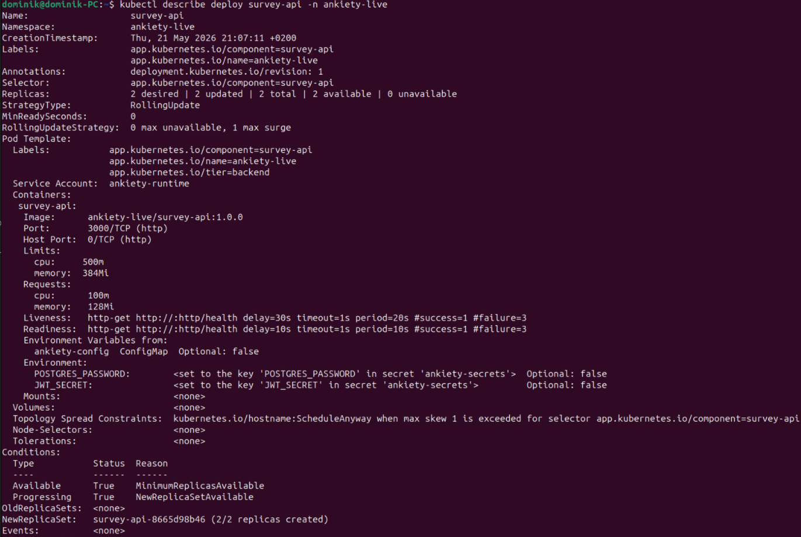

### 14.1. Weryfikacja planowania po dodaniu drugiego węzła

Aby praktycznie pokazać mechanizmy sterujące rozmieszczeniem obiektów na węzłach klastra, do działającego klastra Minikube dodano drugi węzeł:

```bash
minikube node add
```

Po dodaniu węzła należy sprawdzić stan klastra:

```bash
kubectl get nodes -o wide
```

Ponieważ aplikacja korzysta z lokalnie zbudowanych obrazów, po dodaniu nowego węzła warto ponownie załadować obrazy do Minikube:

```bash
minikube image load ankiety-live/survey-api:1.0.0
minikube image load ankiety-live/voting-service:1.0.0
minikube image load ankiety-live/vote-worker:1.0.0
minikube image load ankiety-live/websocket-server:1.0.0
minikube image load ankiety-live/frontend:1.0.0
```

Następnie wykonano ponowny rollout usług bezstanowych, aby scheduler mógł ponownie zaplanować repliki już z dostępnym drugim węzłem:

```bash
kubectl rollout restart deployment/frontend -n ankiety-live
kubectl rollout restart deployment/survey-api -n ankiety-live
kubectl rollout restart deployment/voting-service -n ankiety-live
kubectl rollout restart deployment/websocket-server -n ankiety-live
```

Rozmieszczenie Podów sprawdzono poleceniem:

```bash
kubectl get pods -n ankiety-live -o wide
```

Oczekiwany efekt jest taki, że repliki usług bezstanowych, np. `frontend`, `survey-api`, `voting-service` i `websocket-server`, zostają rozłożone między dwa węzły, jeżeli scheduler ma taką możliwość. Wynika to z konfiguracji `topologySpreadConstraints`, preferowanego `podAntiAffinity` oraz zdefiniowanych `resources.requests`.

PostgreSQL i Redis pozostają pojedynczymi replikami jako `StatefulSet`, co jest celowe. Ich skalowanie wymagałoby dodatkowej konfiguracji klastra PostgreSQL albo Redis Sentinel/Cluster, dlatego w tym projekcie nie zwiększano liczby replik komponentów stanowych.

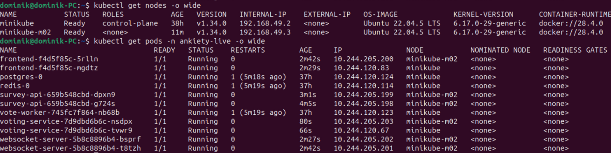


## 15. ServiceAccount i minimalne uprawnienia

W pliku `k8s/03-serviceaccounts.yaml` utworzono `ServiceAccount`:

```yaml
automountServiceAccountToken: false
```

Mikroserwisy używają konta serwisowego bez automatycznego montowania tokenu Kubernetes API. Aplikacja Ankiety Live nie musi zarządzać zasobami Kubernetes. Takie podejście ogranicza uprawnienia i zmniejsza ryzyko bezpieczeństwa. Nie tworzono dodatkowych `Role` ani `RoleBinding`, ponieważ aplikacja nie potrzebuje dostępu do API klastra.

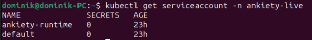

## 16. Test aplikacji

```bash
curl http://ankiety-live.local/health
curl -k https://ankiety-live.local/health
```

Następnie aplikację można otworzyć w przeglądarce:

```text
http://ankiety-live.local
https://ankiety-live.local
```

Przy wejściu przez HTTPS przeglądarka wyświetli ostrzeżenie, ponieważ certyfikat jest self-signed. W środowisku projektowym jest to oczekiwane zachowanie.

Konto testowe tworzone przez `survey-api`:

```text
email: admin@ankiety.pl
hasło: admin123
```

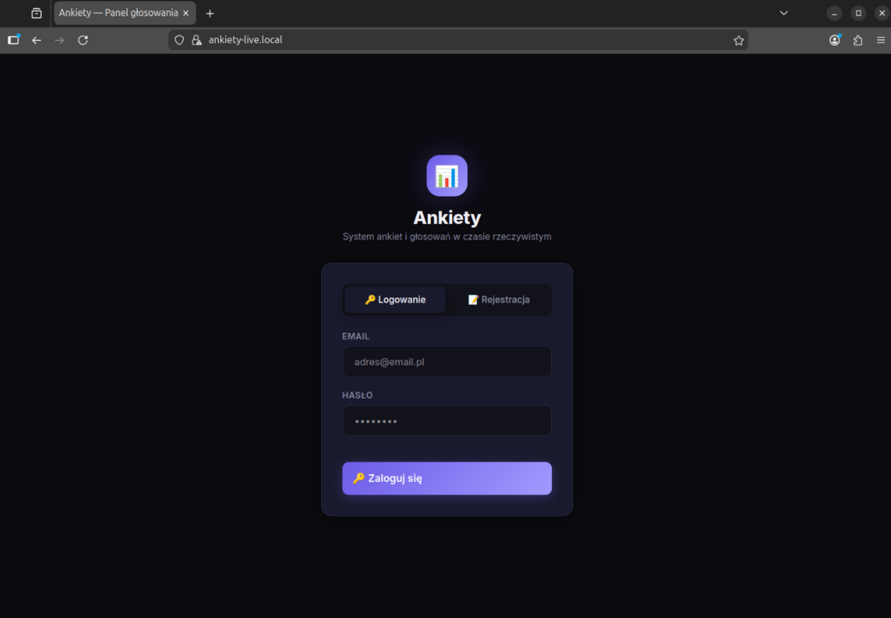

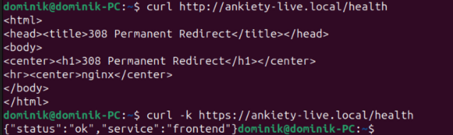

## 17. Weryfikacja poprawności wdrożenia

Do weryfikacji wykorzystano następujące polecenia:

```bash
kubectl get pods -n ankiety-live
kubectl get svc -n ankiety-live
kubectl get ingress -n ankiety-live
kubectl get secret ankiety-live-tls -n ankiety-live
kubectl get pvc -n ankiety-live
```

Oczekiwany wynik:

- wszystkie Pod-y aplikacji są w stanie `Running`,
- Deploymenty mają dostępne wymagane repliki,
- PVC są w stanie `Bound`,
- Ingress ma skonfigurowany host `ankiety-live.local`,
- Ingress ma skonfigurowany TLS secret `ankiety-live-tls`,
- endpoint `/health` zwraca odpowiedź HTTP 200,
- aplikacja jest dostępna w przeglądarce przez HTTP i HTTPS.

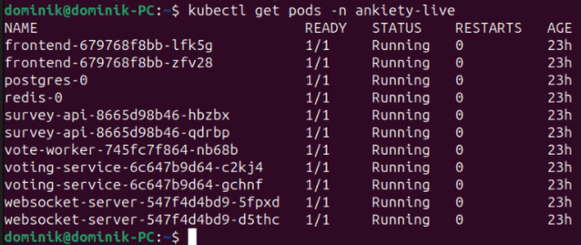

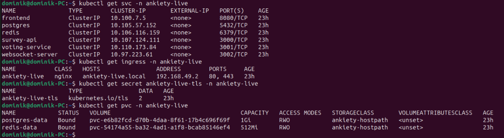

## 18. Podsumowanie

Charakterystyka wdrożenia:

- wybrano Minikube bo ułatwia zarządzanie dodatkami,
- wybrano driver Docker, bo dobrze pasuje do Ubuntu w VM i unika zagnieżdżonego uruchamiania kolejnej VM,
- użyto osobnego namespace `ankiety-live`, żeby odseparować zasoby projektu,
- komponenty bezstanowe uruchomiono jako Deployment, żeby uzyskać rolling update, repliki i samonaprawianie,
- PostgreSQL i Redis uruchomiono jako StatefulSet, bo przechowują dane,
- wszystkie Services ustawiono jako ClusterIP, bo tylko Ingress powinien być punktem wejścia z zewnątrz,
- Ingress kieruje ruch HTTP/HTTPS do frontendu, a frontend przekazuje ruch do mikroserwisów,
- dodano self-signed TLS secret dla hosta `ankiety-live.local`, dzięki czemu aplikacja może być testowana również przez HTTPS,
- dane są przechowywane przez PVC, a nie w kontenerach,
- konfigurację podzielono na ConfigMap i Secret,
- zastosowano limity zasobów, ResourceQuota i LimitRange, żeby kontrolować zużycie klastra,
- zastosowano NetworkPolicy w modelu default-deny plus jawne zezwolenia,
- zastosowano preferowane reguły planowania Pod-ów, które nie blokują klastra jednowęzłowego,
- wyłączono automatyczne montowanie tokenu ServiceAccount, bo aplikacja nie potrzebuje dostępu do Kubernetes API.
